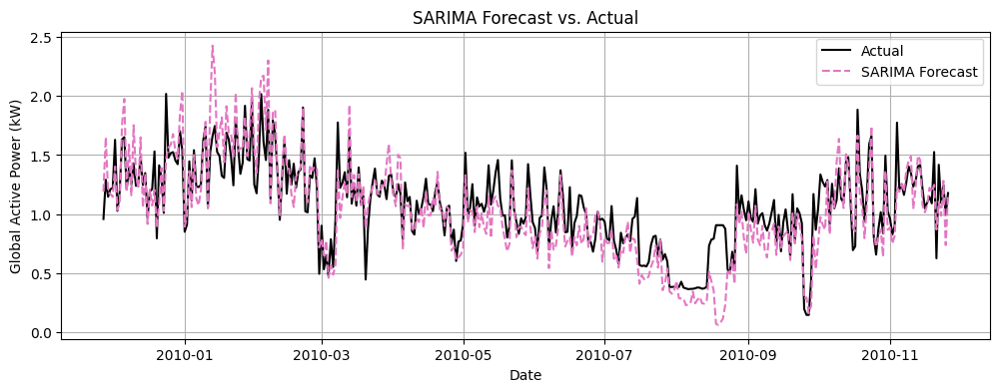
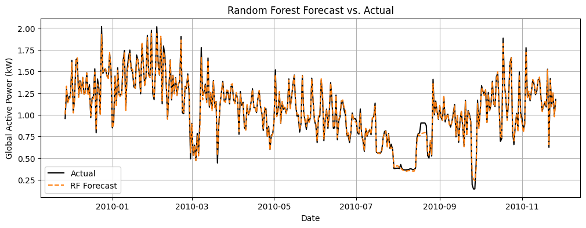
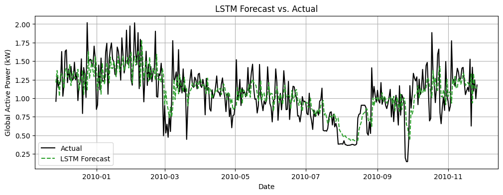

# Energy Consumption Forecasting (Time Series)

Forecast daily household energy consumption using classical and ML/DL time-series models.
This project compares **SARIMAX**, **Random Forest**, and **LSTM** approaches for 1-year ahead forecasting.

## Project goals
- Build a reproducible pipeline to preprocess and aggregate power consumption data
- Engineer time-based features (calendar effects, lags, rolling windows)
- Train and compare multiple forecasting models
- Evaluate with standard regression/time-series metrics (RMSE, MAE, MAPE)

## Dataset
This project uses the *Individual household electric power consumption* dataset.
The raw dataset is **not included** in this repository.  
See: [`Household Electric Power Consumption Dataset on Kaggle`](https://www.kaggle.com/datasets/uciml/electric-power-consumption-data-set/)

## Methods
- **SARIMAX** (statsmodels): seasonal time-series model with exogenous features  
- **Random Forest** (scikit-learn): supervised regression using lag/rolling features  
- **LSTM** (PyTorch): sequence model using sliding windows

## Results (summary)
| Model | RMSE | MAE | MAPE |
|------|------|-----|------|
| SARIMAX | 0.203861 | 0.148490 | 15.0615 |
| Random Forest | 0.029122 | 0.019599 | 2.50802 |
| LSTM | 0.251543 | 0.185157 | 21.32460 |

Example forecast plot:




## Setup
1. Clone the repository:
   ```bash
   git clone https://github.com/Bahae672/energy-consumption-forecasting.git
   cd energy-consumption-forecasting
   ```
2. Install Dependencies
   ```bash
   pip install -r requirements.txt
   ```
3. Download the dataset and place it in the same folder as the notebook. Make sure it's renamed to `household_power_consumption.txt`   
3. Open `Energy_Consumption_Forecasting.ipynb` and run it from top to bottom
